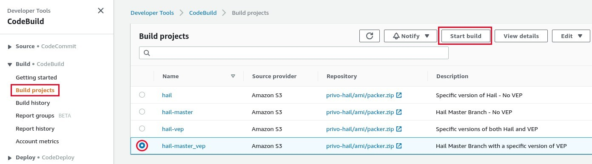
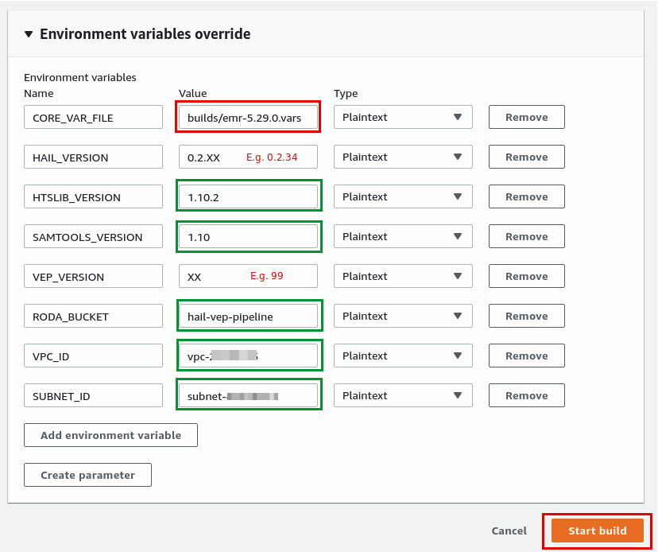

# Hail AMI Creation via AWS CodeBuild

## Table of Contents

- [Hail AMI Creation via AWS CodeBuild](#hail-ami-creation-via-aws-codebuild)
  - [Description](#description)
  - [Prerequisites](#prerequisites)
  - [Deployment](#deployment)
  - [Building](#building)

## Description

A CloudFormation template will deploy AWS CodeBuild Projects that can be used to build specific combinations of [Hail](https://hail.is), [Spark](https://docs.aws.amazon.com/emr/latest/ReleaseGuide/emr-spark.html), and [VEP](https://useast.ensembl.org/info/docs/tools/vep/index.html).  The local packer folder is zipped and pushed to an S3 bucket to be used as the build source.

The Hail master branch HEAD can be used as a build source by **omitting** the `HAIL_VERSION` variable from your CodeBuild Project in CloudFormation.

[VEP](https://useast.ensembl.org/info/docs/tools/vep/index.html) installation can also be excluded by **omitting** the `VEP_VERSION` environment variable.

## Prerequisites

- `hail-ami.yml` CloudFormation template successfully deployed
- If using [VEP](https://useast.ensembl.org/info/docs/tools/vep/index.html), the VEP GRCh37 cache, GRCh38 cache, and LOFTEE data files archives must be in your Hail S3 bucket.  Review the [VEP pre-installation instructions](vep-install.md) for details.
- AWS CLI profile with access to copy files to the S3 bucket/path specified in the CloudFormation template

## Deployment

Each time a file changes under the `packer` directory you must zip and push directory up to S3.  CodeBuild will pull this zip file in for each build.

From the `hail/packer` directory, zip the contents and move it to an S3 bucket/key that matches the parameters set in your CloudFormation.

```bash
14:31 $ zip packer.zip -r ./
  adding: codebuild/ (stored 0%)
  adding: codebuild/buildspec.yml (deflated 38%)
  adding: readme.md (deflated 63%)
  adding: build-wrapper.sh (deflated 65%)
  adding: builds/ (stored 0%)
  adding: builds/emr-5.28.0.vars (deflated 40%)
  adding: builds/emr-5.29.0.vars (deflated 40%)
  adding: builds/emr-5.25.0.vars (deflated 40%)
  adding: builds/emr-5.27.0.vars (deflated 40%)
  adding: builds/vpcs/ (stored 0%)
  adding: builds/vpcs/vpc01.vars (deflated 18%)
  adding: builds/vpcs/vpc01.vars.example (deflated 33%)
  adding: docs/ (stored 0%)
  adding: docs/vep-install.md (deflated 76%)
  adding: docs/hail-ami.md (deflated 59%)
  adding: docs/images/ (stored 0%)
  adding: docs/images/codebuild_environment_override.png (deflated 7%)
  adding: docs/images/codebuild_running.png (deflated 7%)
  adding: docs/images/codebuild_start.png (deflated 1%)
  adding: scripts/ (stored 0%)
  adding: scripts/cluster_manifest.sh (deflated 57%)
  adding: scripts/ami_cleanup.sh (deflated 37%)
  adding: scripts/samtools.sh (deflated 39%)
  adding: scripts/htslib.sh (deflated 42%)
  adding: scripts/hail_build.sh (deflated 56%)
  adding: scripts/vep_install.sh (deflated 66%)
  adding: scripts/R_install.R (deflated 32%)
  adding: amazon-linux.json (deflated 70%)
14:35 $ aws s3 mv packer.zip s3://YOUR-BUCKET/ami/packer.zip
move: ./packer.zip to s3://YOUR-BUCKET/ami/packer.zip
```

## Building

Before building, keep the following in mind:

- Builds can take upwards of 90 minutes.
- AMI names are unique.  If building an updated AMI, deregister the previous.

From the AWS CodeBuild dashboard, select **Build projects** then the desired build's radio button and click **Start build**.



On the next page open the **Environment vairable override** section and enter values specific to your build.

The `VEP_VERSION` identifies what version of VEP the build will pull from the `RODA_BUCKET`.  Values in red should be updated on each build based on files you've updated or included in your `packer.zip` upload. Values in green should not require adjustment unless you've explictly customized the CloudFormation templates.



Once the build beings you can optionally tail logs to view progress.  Closing this window will not terminate the build.


