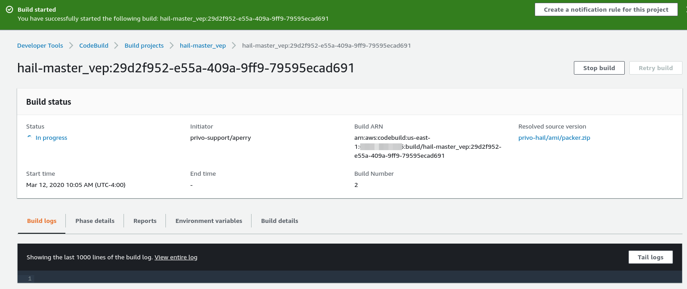

# Building a Custom Hail AMI

This ReadMe contains expanded documentation surrounding the AMI custom build process referenced in the [Deployment Guide](/readme.md#deployment-guide).

Hail on EMR requires the use of a custom AMI with Hail, Spark, VEP, and reference genomes preconfigured.  This build process is driven by Packer, and leverages AWS CodeBuild.  Note that some of these software packages are optional, and the build process can be executed for different versions or combinations of these software packages.

AWS CodeBuild Projects are deployed via a CloudFormation template will that can be used to build specific combinations of [Hail](https://hail.is), [Spark](https://docs.aws.amazon.com/emr/latest/ReleaseGuide/emr-spark.html), and [VEP](https://useast.ensembl.org/info/docs/tools/vep/index.html).  The local `packer` folder is zipped and pushed to an S3 bucket to be used as the build source.

The Hail master branch HEAD can be used as a build source by **omitting** the `HAIL_VERSION` variable from your CodeBuild Project in CloudFormation.

[VEP](https://useast.ensembl.org/info/docs/tools/vep/index.html) installation can also be excluded by **omitting** the `VEP_VERSION` environment variable.

[Public AMIs](/readme.md#public-amis) are published and referenced in the root of this repo.  These AMIs are built using this workflow.  If you wish to create you own custom AMIs, follow the process documented here.

_Note:  Creating these custom AMIs is a complicated process and requires working knowledge of AWS CodeBuild, Packer from Hashicorp, and shell scripting.  Troubleshooting will require intimate knowledge of Hail, VEP, and their associated build processes (including knowledge of perl).  Proceed with caution._

## Table of Contents

- [Building a Custom Hail AMI](#building-a-custom-hail-ami)
  - [Table of Contents](#table-of-contents)
  - [Directory Structure](#directory-structure)
    - [Builds](#builds)
    - [CodeBuild](#codebuild)
    - [Scripts](#scripts)
  - [Deployment Guide](#deployment-guide)
    - [Prerequisites](#prerequisites)
    - [Deployment](#deployment)
  - [Execute a GUI Build](#execute-a-gui-build)
  - [Execute a CLI Build](#execute-a-cli-build)
    - [Prerequisites](#prerequisites-1)
    - [Execution](#execution)
    - [A Note on Packer](#a-note-on-packer)
  - [Troubleshooting](#troubleshooting)
    - [AMI Exists](#ami-exists)

## Directory Structure

Below is a diagram of the directory structure, followed by a description of the contents of each directory.

```tree -L 3
.
├── builds
│   └── vpcs
├── codebuild
├── docs
│   └── images
└── scripts
```

### Builds

The `builds` directory contains variable definitions that are used as arguments to the primary build JSON, [amazon-linux.json](amazon-linux.json).

Target VPCs, which may exist in remote accounts, are broken out into individual files under `builds/vpcs`.  There is an example VPC var file in the repository.  The subnet ID variable in your var file must be a public subnet.  This allows the packer process in CodeBuild to connect to your instance via SSH.   Note that after any adjustments to the settings or files in `builds/vpcs` you will need to update the path to that file in the [hail-ami.yml](../hail-ami.yml) CloudFormation template for the appropriate CodeBuild project.

### CodeBuild

The `codebuild` directory contains configuration items related to AWS CodeBuild, which executes the Packer build process to build the custom AMIs.  The [buildspec.yml](codebuild/buildspec.yml) file contains instructions for Packer installation and invocation via AWS CodeBuild.  See [the Hail AMI markdown](docs/hail-ami.md) for more details.

### Scripts

The `scripts` directory contains bash scripts supporting the build components (VEP, Hail, supporting python packages, etc.).  These scripts may be referenced from [amazon-linux.json](amazon-linux.json).  Scripts in this directory are linted with [ShellCheck](https://github.com/koalaman/shellcheck).

## Deployment Guide

### Prerequisites

- AWS CLI profile with access to copy files to the S3 bucket/path specified in the CloudFormation template
- [Packer installed](https://www.packer.io/downloads.html) if executing a CLI build

### Deployment

To build a custom Hail AMI for use with EMR, follow these steps:

1. Deploy the S3 resources described in the [Deployment Guide](/readme.md#deployment-guide) contained in the `hail-s3.yml` template

2. Deploy the AWS CodeBuild resources described in the [Deployment Guide](/readme.md#deployment-guide) contained in the `hail-ami.yml` template

3. If you'll be using [VEP](https://useast.ensembl.org/info/docs/tools/vep/index.html) it will be pulled in from the [Registry of Open Data on AWS](https://registry.opendata.aws) (RODA).  There is no action required outside setting your VEP version during the CodeBuild operation.

4a. Follow the steps for to [execute a GUI build](#execute-a-gui-build)

OR

4b. Follow the steps for to [execute a CLI build](#execute-a-cli-build)

## Execute a GUI Build

Before building, keep the following in mind:

- Builds including VEP can take a _very_ long time (upwards of 1-2 hours in some cases)
- AMI names are unique.  If building an updated AMI, deregister the previous

From the AWS CodeBuild dashboard, select the desired build's radio button and click **Start build**.


On the next page you may optionally override any build parameters then click **Start build**.

Once the build beings you can optionally tail logs to view progress.  Closing this window will not terminate the build.



## Execute a CLI Build

To execute a build using the CLI, follow these steps.

### Prerequisites

- AWS IAM profile configured in your shell with a **region** defined. This profile **must have permission to launch instances and create AMIs**.  The majority of required IAM permissions are documented [here](https://www.packer.io/docs/builders/amazon.html).  [iam:PassRole](https://docs.aws.amazon.com/IAM/latest/UserGuide/id_roles_use_passrole.html) is also required for the CodeBuild service role to associate the hail-packer EC2 instance role to the launched instance
- Shell `AWS_PROFILE` exported
- [Packer installed](https://www.packer.io/downloads.html) -  Version 1.4 or greater is recommended

### Execution

Builds are executed via the [build wrapper](build-wrapper.sh).  This wrapper has two methods of invocation:

- AWS CodeBuild

  Environment variables are defined in the CodeBuild Project and the script is invoked with no arguments.  See [the Hail AMI markdown](docs/hail-ami.md) for more details.

- Standard CLI

  Arguments are added via the CLI. Use `./build-wrapper --help` for more details.

  ```bash
  usage: build-wrapper.sh [ARGUMENTS]

    --hail-version  [Number Version]      - OPTIONAL.  If omitted, the current HEAD of master branch will be pulled.
    --vep-version   [Number Version]      - OPTIONAL.  If omitted, VEP will not be included.
    --hail-bucket   [Your S3 Bucket Name] - REQUIRED
    --roda-bucket   [RODA S3 Bucket Name] - REQUIRED
    --var-file      [Full File Path]      - REQUIRED
    --vpc-var-file  [Full File Path]      - REQUIRED

    Example:

   build-wrapper.sh --hail-version 0.2.33 \
                    --vep-version 99 \
                    --hail-bucket YOUR_HAIL_BUCKET \
                    --roda-bucket hail-vep-pipeline \
                    --var-file builds/emr-5.29.0.vars \
                    --vpc-var-file builds/vpcs/account123-vpc01.vars
  ```

### A Note on Packer

Each time a file changes under the `packer` directory you must zip and push directory up to S3.  CodeBuild will pull this zip file in for each build.

From the `hail/packer` directory, zip the contents and move it to an S3 bucket/key that matches the parameters set in your CloudFormation.

```bash
14:31 $ zip packer.zip -r ./
  adding: codebuild/ (stored 0%)
  adding: codebuild/buildspec.yml (deflated 38%)
  adding: build-wrapper.sh (deflated 61%)
  adding: builds/ (stored 0%)
  adding: builds/emr-5.25.0.vars (deflated 42%)
  adding: builds/vpcs/ (stored 0%)
  adding: builds/vpcs/vpc01.vars.example (deflated 34%)
  adding: ReadMe.md (deflated 57%)
  adding: docs/ (stored 0%)
  adding: docs/hail-ami.md (deflated 59%)
  adding: docs/images/ (stored 0%)
  adding: docs/images/codebuild_running.png (deflated 3%)
  adding: docs/images/codebuild_start.png (deflated 3%)
  adding: scripts/ (stored 0%)
  adding: scripts/ami_cleanup.sh (deflated 37%)
  adding: scripts/samtools.sh (deflated 39%)
  adding: scripts/htslib.sh (deflated 42%)
  adding: scripts/hail_build.sh (deflated 54%)
  adding: scripts/vep_install.sh (deflated 65%)
  adding: scripts/R_install.R (deflated 32%)
  adding: amazon-linux.json (deflated 69%)
14:35 $ aws s3 mv packer.zip s3://YOUR-BUCKET/ami/packer.zip
move: ./packer.zip to s3://YOUR-BUCKET/ami/packer.zip
```

## Troubleshooting

### AMI Exists

AMI names are unique.  In order to rebuild an AMI with the same name you will need to deregister the AMI your AWS account and target region.
