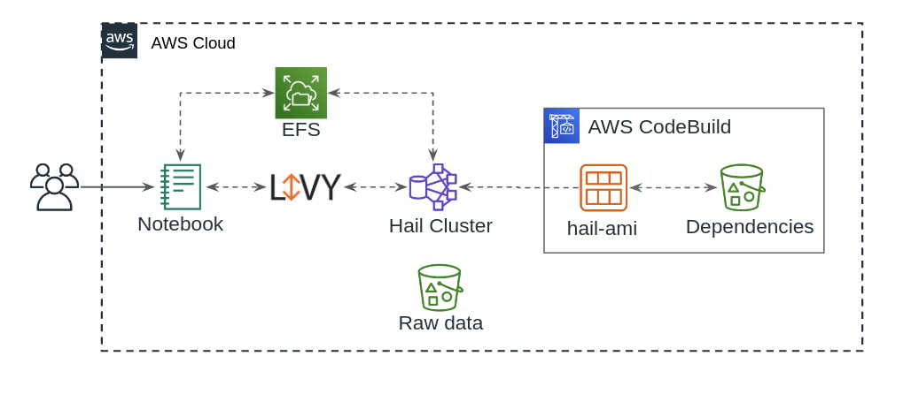
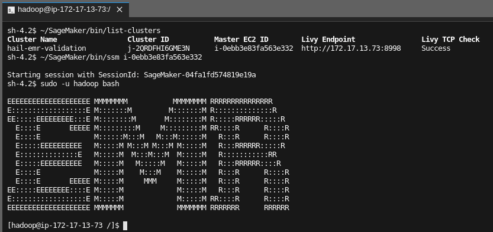

# Hail on EMR
This solution was designed to provide a reproducible, easy to deploy environment to integrate [Hail](https://hail.is) with [AWS EMR](https://aws.amazon.com/emr/faqs/?nc=sn&loc=7).  Where possible, AWS native tools have been used.



To integrate Hail and EMR, we leverage [Packer](https://www.packer.io/) from Hashicorp alongside [AWS CodeBuild](https://aws.amazon.com/codebuild/faqs/?nc=sn&loc=5) to create a custom AMI pre-packaged with Hail, and optionally containing the [Variant Effect Predictor (VEP)](https://uswest.ensembl.org/info/docs/tools/vep/index.html).  Then, an EMR cluster is launched using this custom AMI.

Users access Jupyter via a SageMaker notebook hosted in AWS, and pass commands to Hail from the notebook via [Apache Livy](https://livy.incubator.apache.org/).  

This repository contains CloudFormation templates, scripts, and sample notebooks which will enable you to deploy this solution in your own AWS account. Certain parts of this repository assume a working knowledge of:  AWS, CloudFormation, S3, EMR, Hail, Jupyter, SageMaker, EC2, Packer, and shell scripting.  

The repository is organized into several directories:

- cloudformation - Contains the templates used to deploy resources in AWS
- packer - Documenation and example configuration of Packer (used in the AMI build process)
- jupyter - Sample Jupyter Notebook for SageMaker deployment

This ReadMe will walk through deployment steps, and highlight potential pitfalls.


## Table of Contents

- [Deployment Guide](#deployment-guide)
- [CloudFormation Templates](#cloudformation-templates)
  - [hail-s3](#hail-s3)
  - [hail-jupyter](#hail-jupyter)
  - [hail-ami](#hail-ami)
  - [hail-emr](#hail-emr)
    - [Autoscaling Task Nodes](#autoscaling-task-nodes)
    - [Plotting](#plotting)
    - [SSM Access](#ssm-access)
- [Public AMIs](#public-amis)
  - [Hail with VEP](#hail-with-vep)
  - [Hail Only](#hail-only)


## Deployment Guide
_Note:  This process will create S3 buckets, IAM resources, AMI build resources, a SageMaker notebook, and an EMR cluster.  These resources may not be covered by the AWS Free Tier, and may generate significant cost.  For up to date information, refer to the [AWS Pricing page](https://aws.amazon.com/pricing/)._

_You will require elevated IAM privileges in AWS, ideally AdministratorAccess, to complete this process._


To deploy Hail on EMR, follow these steps:  

1. Log into your AWS account, and access the CloudFormation console

2. Deploy the [hail-s3.yml](#hail-s3) template to create S3 resources, ensuring you use unique names for the S3 buckets

3. Once the `hail-s3` stack deployment completes, deploy the [hail-jupyter.yml](#hail-jupyter) template to create the SageMaker notebook instance

4. At this point you have created S3 buckets, and now have a SageMaker notebook instance you can log into.  You may repeat Step 3 as needed for multiple users.  For more details, see the [hail-jupyter](#hail-jupyter) section below

5. Once the `hail-jupyter` stack deployment completes, deploy the [hail-ami.yml](#hail-ami) template to create the custom AMI build process using CodeBuild and Packer (note that this step is optional if you intend to use the public AMIs listed below)

6. If you do not intend to use the public AMIs, follow the [expanded documentation](packer/readme.md) to create your Hail AMIs

7. Once the AMI build is complete (or you have selected your public AMI), deploy the [hail-emr.yml](#hail-emr) template to create the EMR cluster using a custom Hail AMI.  Note that you _must_ deploy the EMR cluster in the same subnet that you deployed the SageMaker notebook in step 4, otherwise you may run into routing issues

8. After the `hail-emr` stack deployment completes, you may log into the Jupyter notebook and access the Hail cluster

Note that follow these steps _in order_ is crucial, as resources created by one stack may be used as parameter entries to later stacks.  For detailed information about individual templates (including troubleshooting), see the following section.


## CloudFormation Templates

This section contains detailed descriptions of the CloudFormation templates discussed in the [Deployment Guide](#deployment-guide).


### hail-s3

This template is deployed _once_.

The template consumes 3 parameters, and creates 3 S3 buckets with [Server-Side Encryption](https://docs.aws.amazon.com/AmazonS3/latest/dev/serv-side-encryption.html) (SSE).

- Hail Bucket - contains VEP cache and configuration JSON for Hail
- Log Bucket - EMR logs will be written here
- SageMaker Jupyter Bucket - Users notebooks will be backed up here, and common/example notebooks will be stored here as well.

*Note: S3 bucket names MUST be unique.  If the S3 bucket name is in use elsewhere, deployment will fail.*


### hail-jupyter

This template can be deployed _multiple times_ (one per user).  

The template deploys a SageMaker notebook instance which will be used for operations against the Hail EMR cluster.  The user's `/home/ec2-user/SageMaker` directory is backed up via crontab to the SageMaker Jupyter bucket created in the previous step with the `hail-s3` CloudFormation template.  

The user's notebook instance will have full control via the AWS CLI over their respective S3 subdirectory.  For example, if a notebook instance is named `aperry`, the user has full control of S3 objects in `s3://YOUR_JUPYTER_BUCKET/aperry/` from the terminal on that instance via the AWS CLI.

When a new notebook instance launches, the instance will sync in any scripts in the following directories located in the root of the bucket to the following locations on the local instance:

- `common-notebooks` => `/home/ec2-user/SageMaker/common-notebooks`
- `scripts` => `/home/ec2-user/SageMaker/bin`

You may wish to seed those directories in S3 with the identically named directories under `emr-hail/jupyter` in this repository.  Doing so will allow for a working Hail Plotting example.

CLI Example from repository root directory:

```bash
aws --profile <PROFILE> s3 sync jupyter/ s3://<YOUR_JUPYTER_BUCKET>/ --acl bucket-owner-full-control
```

Post upload, the bucket contents should look similar to this:

```bash
14:16 $ aws --profile <PROFILE> s3 ls --recursive s3://<YOUR_JUPYTER_BUCKET>/
2019-09-30 14:14:36      13025 common-notebooks/hail-plotting-example.ipynb
2019-09-30 14:14:36       1244 scripts/list-clusters
2019-09-30 14:14:36       1244 scripts/ssm
```


### hail-ami
_Note: Deployment of this template is OPTIONAL.  It is only necessary if you wish to create your own custom AMIs.  [Public AMIs](#public-amis) are published below and can be used in place of this deloyment process_

This template is deployed _once_.

Use this template to create your own custom Hail AMI for use with EMR.  Alternatively, instead of deploying this template, you may leverage the [public AMIs](#public-amis) listed below.  

This template leverages [Packer](https://www.packer.io/) in AWS CodeBuild to create AMIs for use with EMR.  You can specify a specific Hail Version, VEP version, and target VPC and subnet.

Review the [expanded documentation](packer/readme.md) for further details.


### hail-emr

This template can be deployed _multiple times_ (one per cluster).

This template deploys the EMR cluster using the custom Hail AMI.  There is a single master node, a minimum of 1 core node, and optional autoscaling task nodes.

_Note:  The EMR cluster MUST be deployed in the same subnet as the Jupyter notebook.  Otherwise, you may see ephemeral routing issues._

#### Autoscaling Task Nodes

Task nodes can be set to `0` to omit them.   The target market, `SPOT` or `ON_DEMAND`, is also set via parameters.  If `SPOT` is selected, the bid price is set to the current on demand price of the selected instance type.

The following scaling actions are set by default:

- +2 instances when YARNMemoryAvailablePercentage < 15 % over 5 min
- +2 instances when ContainerPendingRatio > .75 over 5 min
- -2 instances when YARNMemoryAvailablePercentage > 75 % over 5 min

#### Plotting

EMR steps are used to add a location for Livy to output Hail plots directly to files on the master node.   Once written there those plots can be retrieved in the Sagemaker notebook instance and plotted inline.  See the [jupyter/common-notebooks/hail-plotting-example.ipynb](jupyter/common-notebooks/hail-plotting-example.ipynb) for an example.

The plotting pass through is required because the Sparkmagic/Livy can only pass spark and pandas dataframes back to the notebook.

#### SSM Access

The [AWS Systems Manager Agent](https://docs.aws.amazon.com/systems-manager/latest/userguide/ssm-agent.html) can be used to gain ingress to the EMR nodes.  This agent is pre-installed on the AMI.  CloudFormation parameters exist on both the EMR stack and the Jupyter stack to optionally allow notebook IAM roles shell access to the EMR nodes via SSM.  The respective stack parameters must both be set to `true` to allow proper IAM access.

Example connection from Jupyter Lab shell:




## Public AMIs

Public AMIs are available in specific regions. Select the AMI for your target region and deploy with the noted version of EMR for best results.


### Hail with VEP

| Region    | Hail Version | VEP Version | EMR Version | AMI ID                |
|:---------:|:------------:|:-----------:|:-----------:|:--------------------: |
| us-east-1 | 0.2.29       | 98          | 5.28.0      | ami-0b016dfca524fec33 |
| us-east-2 | 0.2.29       | 98          | 5.28.0      | ami-082b3c5dadecc4a87 |
| us-west-2 | 0.2.29       | 98          | 5.28.0      | ami-0aa2d49e3149759e9 |
| us-east-1 | 0.2.27       | 98          | 5.28.0      | ami-0eff76d452e943507 |
| us-east-2 | 0.2.27       | 98          | 5.28.0      | ami-074bd78cf15dce0a5 |
| us-west-2 | 0.2.27       | 98          | 5.28.0      | ami-010e68c2c559b37cf |
| us-east-1 | 0.2.25       | 98          | 5.27.0      | ami-0b16f8ef3418e707a |
| us-east-2 | 0.2.25       | 98          | 5.27.0      | ami-0fc5abc51396918fd |
| us-west-2 | 0.2.25       | 98          | 5.27.0      | ami-0feddab8068926b24 |


### Hail Only

| Region    | Hail Version | EMR Version | AMI ID                |
|:---------:|:------------:|:-----------:|:--------------------: |
| us-east-1 | 0.2.29       | 5.28.0      | ami-05e440db5d3e3bcba |
| us-east-2 | 0.2.29       | 5.28.0      | ami-064ce48aad3e10749 |
| us-west-2 | 0.2.29       | 5.28.0      | ami-0d8c99d07ae2ebc5b |
| us-east-1 | 0.2.27       | 5.28.0      | ami-038d051a8baaf60ff |
| us-east-2 | 0.2.27       | 5.28.0      | ami-0b6d8fea9018ff7ac |
| us-west-2 | 0.2.27       | 5.28.0      | ami-096d1b6615904cbe0 |
| us-east-1 | 0.2.25       | 5.27.0      | ami-073f98d578b35345d |
| us-east-2 | 0.2.25       | 5.27.0      | ami-0c2ab8dbb74c44e36 |
| us-west-2 | 0.2.25       | 5.27.0      | ami-0842116d93dd08609 |
